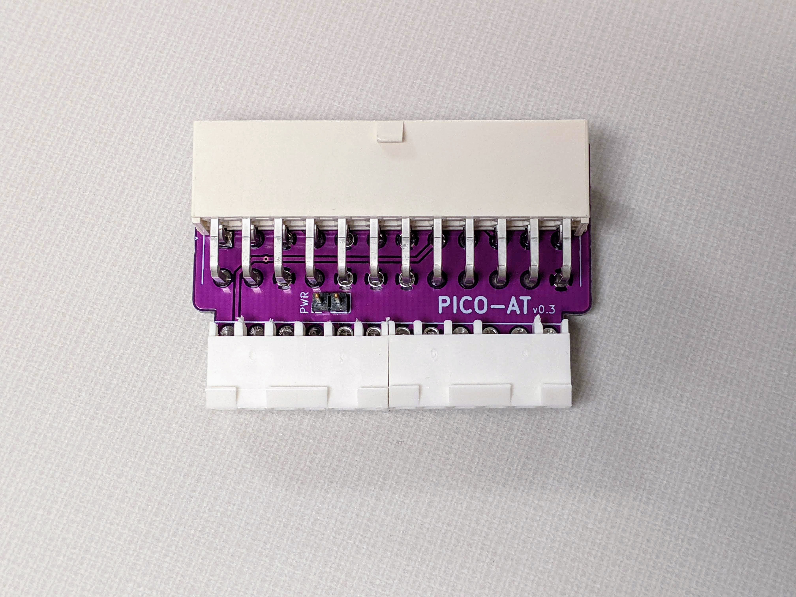

# PICO-AT Power Adapter
This board is a PICO-PSU to AT power adapter which also provides -5VDC.

## Intro
I designed this board for a small SBC that I could not fit a large power supply in the enclosure. This design is recommended for PICO-PSU units, and can be used with various retro motherboards that have the AT-style power connector. I have two versions in this repository, the normal version and a high current version. The high current version can be used with later model systems drawing more than 8 amps on the 5V rail. I recommend you don't go over 14 amps on the 5V rail with the high current version.

## Building
* Detailed BOM for Mouser parts is included. Subsitutions may be necessary depending on the chip/component shortages.
* Solder the SMD components first, then solder the through-hole components. The 7905 component will need to be flush clipped with the board before soldering, to ensure the ATX connector sits flat.
* Depending on your motherboard, this may not fit without modification to the motherboard's power connector. You will need to have the square pins on the power connector, not the larger round pins or flat pins. Most AT boards have the flat pins. See notes section below.
* The power switch pin header is for connecting a standard toggle switch to control the ATX power supply's on/off state. You can wire it to your AT case's power switch. In a modern PC case, you can wire it to a latching power switch or on/off toggle switch. 

## Notes
Molex only produced the flat style AT pin header (8619) for use with the 90331 power supply connectors. The flat pin 8619 style motherboard side connectors were only used on AT motherboards to a certain time period, then Molex discontinued the 8619 and replaced it with the KK 396 square pin connector, which is compatible with the 90331 connector as well as KK 396 female connectors, obviously. I only have one motherboard in my collection that came standard with the KK 396 connector. If the motherboard uses the old 8619 connector, it would need to be replaced with the KK 396 type. So, with the KK 396 compatible with both the 90331 and KK 396 itself, you lose no functionality with an original AT power supply connector. I have validated this with motherboards I have converted. The part number for the motherboard side is Molex 41791-0836. (2 required)

## Community Works
Check out Vogons.org for the thread where people are building these and also modifying the design to have fan headers and other cool stuff: https://www.vogons.org/viewtopic.php?f=46&t=86465

## Other
This is an open source design. Feel free to do what you want with it.
